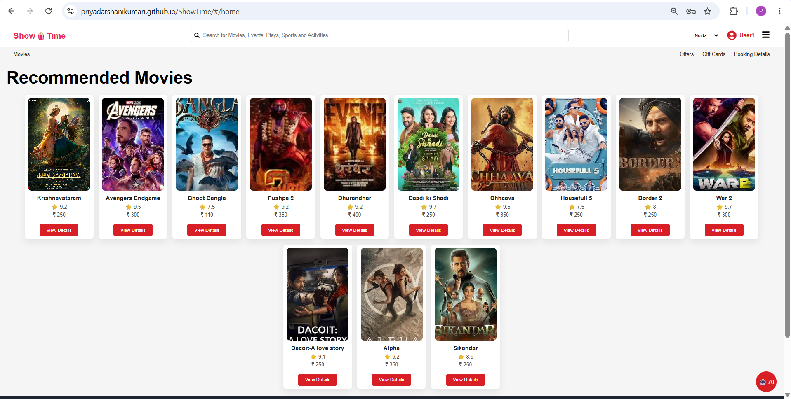
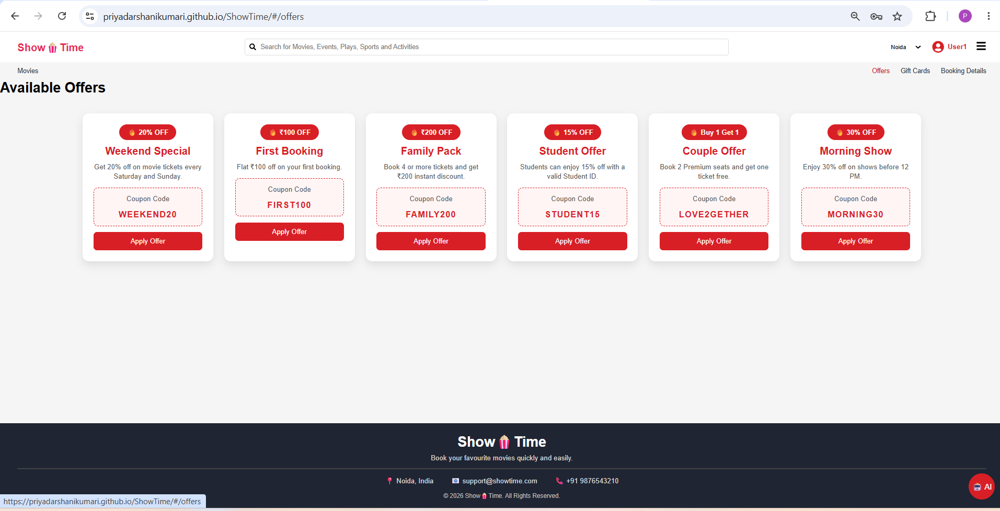
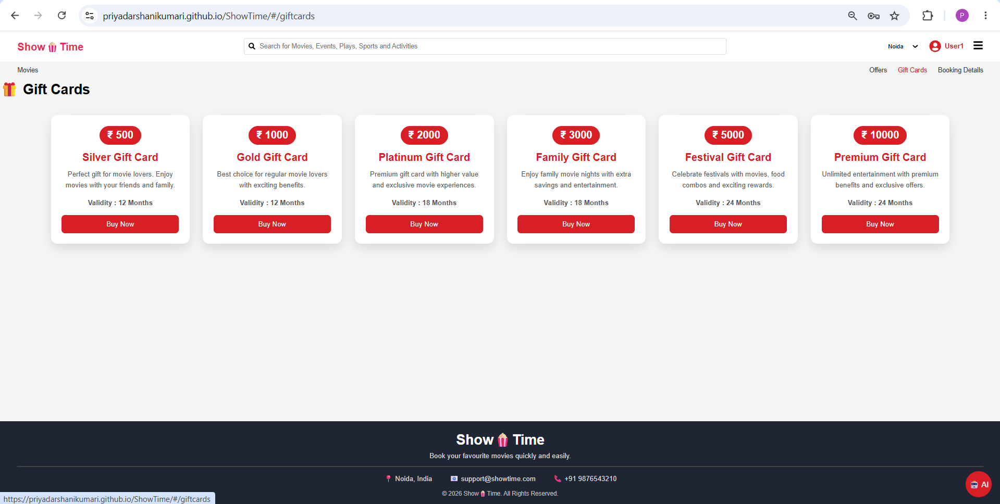

# 🎬 ShowTime – Movie Ticket Booking Web Application

ShowTime is a responsive Movie Ticket Booking Web Application developed using React.js and Vite. It enables users to browse movies, search titles, view movie details, book tickets, apply discount offers, purchase gift cards, and manage bookings through a clean and user-friendly interface.

## 🚀 Live Demo

🌐 https://priyadarshanikumari.github.io/ShowTime/

## 📸 Screenshots

### 🏠 Home Page



---

### 🏷️ Offers Page



---

### 🎁 Gift Cards



---

## ✨ Features

- 🔐 User Signup & Login
- 🎬 Browse Latest Movies
- 🔍 Search Movies
- 📄 Movie Details Page
- 🎟️ Seat Selection & Ticket Booking
- 📅 Booking History
- 🏷️ Apply Discount Offers
- 🎁 Purchase Gift Cards
- 👤 User Profile
- 🤖 AI Chatbot Assistant
- 💾 Local Storage Support
- 📱 Responsive Design

---

## 🛠️ Technologies Used

- React.js
- Vite
- JavaScript (ES6+)
- HTML5
- CSS3
- React Router DOM
- React Icons
- Local Storage
- Git & GitHub
- GitHub Pages

---

## 📂 Project Structure

```
src
│
├── components
├── pages
├── data
├── styles
├── utils
├── App.jsx
└── main.jsx
```

---

## ⚙️ Installation

Clone the repository

```bash
git clone https://github.com/Priyadarshanikumari/ShowTime.git
```

Go to project folder

```bash
cd ShowTime
```

Install dependencies

```bash
npm install
```

Run the project

```bash
npm run dev
```

Build for production

```bash
npm run build
```

Deploy to GitHub Pages

```bash
npm run deploy
```

---

## 📌 Future Improvements

- Online Payment Integration
- Real-Time Seat Availability
- Movie Trailer Integration
- Backend Authentication
- Firebase / MongoDB Integration
- Email Ticket Confirmation
- Dark Mode

---

## 👩‍💻 Author

**Priyadarshani Kumari**

- GitHub: https://github.com/Priyadarshanikumari
- LinkedIn: *www.linkedin.com/in/priyadarshani-kumari-859b432b0*

---

## ⭐ Support

If you like this project, don't forget to **Star ⭐ the repository**.